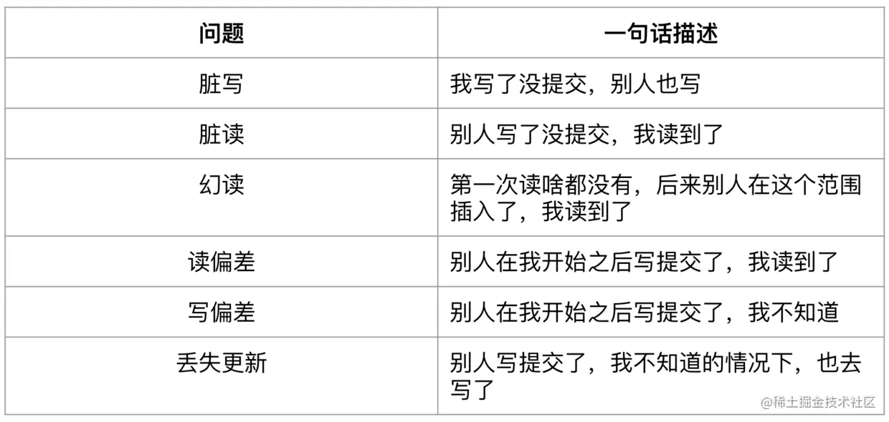

# 数据库 - 并发执行事务的问题
## 脏写（Dirty Write）
还未提交的事务写了另一个未提交事务所写过的数据，称为脏写。

比如： 两个并发执行的事务A、B，A写了x，在A还未提交前，B也写了x，然后A提交，此时虽然B还没有提交，但是A也会发现自己写的x不见了。

## 脏读（Dirty Read）
由于事务的可回滚特性，因此commit前的任何读写，都有被撤销的可能。

假如某个事物读取了还未commit事务的写数据，后来对方回滚了，那么读到的就是脏数据，因为它已经不存在了。

## 不可重复读（Non-Repeatable Read）
事务A读取一个值，但是没有对它进行任何修改，另一个并发事务B修改了这个值并且提交了，事务A再去读，发现已经不是自己第一次读到的值了，是B修改后的值，就是不可重复读。 

简单来说就是第一次读的值，啥都没做，下次读它也有可能发生变化。

## 幻读（Phantom）
与不可重复读非常类似，事务A查询一个范围的值，另一个并发事务B往这个范围中插入了数据并提交，然后事务A再查询相同范围，发现多了一条记录，或者某条记录被别的事务删除，事务A发现少了一条记录。

**不可重复读面向的是“同一条记录”，而幻读面向的是“同一个范围”**

## 读偏差（Read Skew）
读结果违反业务一致性。

比如X、Y两个账户余额都为50，他们总和为100，事务A读X余额为50，然后事务B从X转账50到Y然后提交，事务A在B提交后读Y发现余额为100，那么它们总和变成了150，此时违反业务一致性。

## 写偏差（Write Skew）
事务commit之前写前提被破坏，导致写入了违反业务一致性的数据。

场景：读出某些数据，作为另一些写入的前提条件，但是在提交前，读入的数据就已被别的事务修改并提交，这个事务并不知道，然后commit了自己的另一些写入，写前提在commit前就被修改，导致写入结果违反业务一致性。

写偏差发生在写前提与写入目标不相同的情境下。

## 丢失更新（Lost Updates）
由于未提交事务之间看不到对方的修改，因此都以一个旧前提去更新同一个数据，导致最后的提交结果是错误值。

假设有账户X，余额100元，事务A、B同时向X分别充值10元、20元，最后结果应该为130元，但是由于丢失更新，最后是110元。

## 总结

## Reference
- [从0到1理解数据库事务（上）：并发问题与隔离级别](https://juejin.cn/post/6844903927536844808)